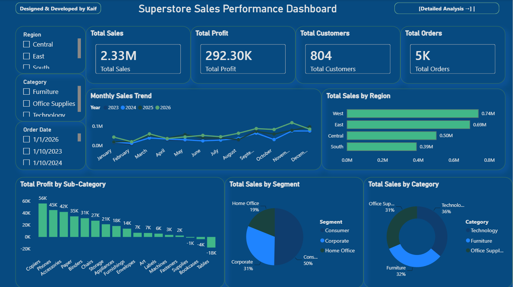
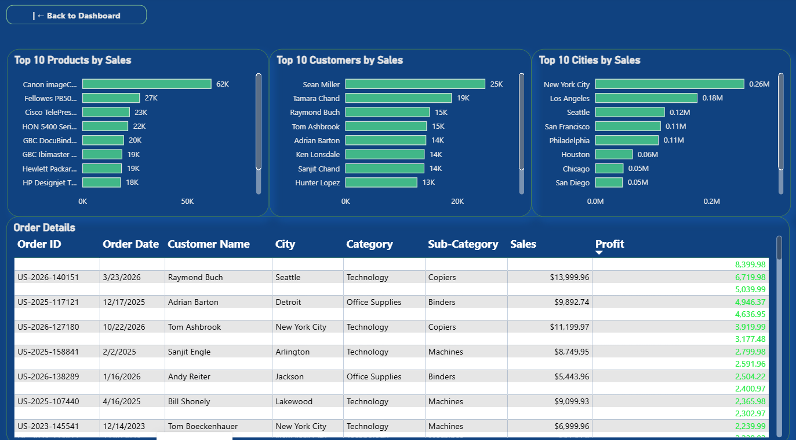
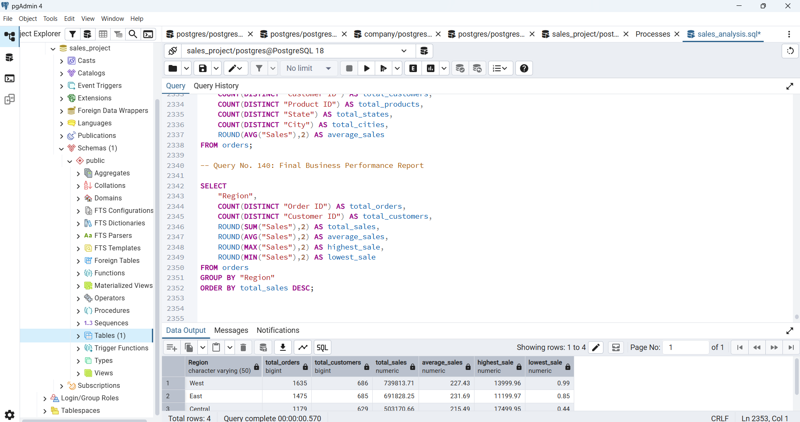

README.md
# 📊 Superstore Sales Analysis Dashboard

### End-to-End Data Analytics Project using PostgreSQL, SQL, Power BI & DAX

---

## 📌 Project Overview

This project is an end-to-end Sales Analysis Dashboard developed using PostgreSQL, SQL, Power BI, and DAX.

The goal of this project is to analyze Superstore sales data, identify business trends, monitor key performance indicators (KPIs), and generate actionable insights through interactive dashboards.

The complete workflow includes:

- Importing the dataset into PostgreSQL
- Writing SQL queries for business analysis
- Connecting PostgreSQL with Power BI
- Creating DAX measures
- Designing interactive dashboards
- Generating business insights

---

## 🎯 Objectives

- Analyze Total Sales and Profit
- Track Monthly Sales Trends
- Analyze Sales by Region
- Compare Product Categories
- Identify Top Customers
- Identify Top Products
- Analyze Sales by City
- Monitor Order-Level Performance

---

## 🛠️ Tech Stack

- PostgreSQL
- SQL
- Power BI
- DAX
- CSV Dataset

---

# 📷 Dashboard Preview

## 📊 Main Dashboard

---

## 📈 Detailed Analysis Dashboard

---

## 🗄 PostgreSQL Database

